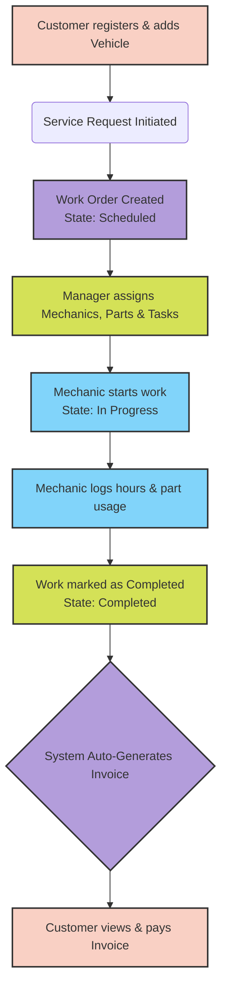

# MechanicShop API

MechanicShop API is a high-performance, scalable backend RESTful API built for modern auto repair shops to manage their end-to-end operations seamlessly. It is designed using **Clean Architecture** principles and built on **ASP.NET Core 9**, **Entity Framework Core**, and **PostgreSQL**.

## The Problem

Auto repair shops frequently face challenges in managing their daily operations due to fragmented systems. Key problems include:
- **Complex Workflows:** Tracking a vehicle's repair journey from drop-off to completion involves multiple stakeholders (customers, managers, mechanics).
- **Dynamic Pricing & Inventory:** Managing inventory levels while ensuring that parts and labor costs reflect the price at the time of the service, rather than current fluctuating market prices.
- **Manual Invoicing:** Generating accurate invoices manually is error-prone, especially when combining variable labor hours, taxes, discounts, and historical part prices.

## How We Solve It

MechanicShop API provides a centralized backend solution that automates and secures these processes:
- **Modular Domain Model:** Utilizes Clean Architecture to strictly decouple business logic from infrastructure, making the system highly testable and maintainable.
- **Resilient Pricing Engine:** Captures and locks in part prices (`UnitPriceAtUse`) and labor rates (`LaborCostAtUse`) at the exact moment they are added to a work order. This guarantees accurate, immutable historical records for invoicing.
- **Automated Invoicing:** Seamlessly generates detailed invoices with calculated taxes and discounts the moment a work order state transitions to `Completed`, leveraging the Unit of Work pattern to ensure transactional data integrity.
- **Role-Based Access Control (RBAC):** Secures endpoints using JWT authentication with distinct access boundaries for Admins/Managers, Employees, and Customers.
- **Optimized Performance:** Ensures lightning-fast API responses by pushing data-heavy operations (like pagination, filtering, and complex joins) down to the PostgreSQL database level.

## Project Flow

The following diagram illustrates the core lifecycle of a Work Order within the system:



## Tech Stack

- **Framework:** .NET 9.0 (ASP.NET Core Web API)
- **Architecture:** Clean Architecture (Domain, Application, Infrastructure, API)
- **Database:** PostgreSQL with Entity Framework Core
- **Testing:** xUnit, Moq, Testcontainers
- **Performance Testing:** k6
- **Authentication:** JWT (JSON Web Tokens)

## Getting Started

1. **Clone the repository:**
   ```bash
   git clone <repository_url>
   ```
2. **Setup the Database:**
   Ensure PostgreSQL is running and update the connection string in `appsettings.Development.json`.
3. **Run Migrations:**
   ```bash
   dotnet ef database update --project src/MechanicShop.Infrastructure --startup-project src/MechanicShop.Api
   ```
4. **Run the API:**
   ```bash
   dotnet run --project src/MechanicShop.Api
   ```
